# QUY TRÌNH ADMIN XEM VÀ CẬP NHẬT HỒ SƠ NHÂN SỰ

## 🔄 Sơ Đồ Quy Trình

```mermaid
flowchart TD
    A[🚪 User vào App<br/>page.tsx] --> B{Đã đăng nhập?}
    B -->|Chưa| C[🔐 Hiển thị Cổng Đăng Nhập<br/>CongDangNhap.tsx]
    C --> D[📝 Nhập Email/Password]
    D --> E{Đăng nhập thành công?}
    E -->|Không| D
    E -->|Có| F[💾 Lưu USER_INFO vào localStorage<br/>Lưu USER_ROLE = 'admin']
    F --> G[🏠 Chuyển đến Trang Chủ<br/>trangchu/page.tsx]
    B -->|Có| G
    
    G --> H[📱 Hiển thị MenuTren + MenuDuoi]
    H --> I[👤 Admin bấm vào nút 'Phòng Ban'<br/>MenuDuoi.tsx]
    
    I --> J[📋 Hiển thị Danh sách Phòng Ban<br/>NutPhongBan.tsx]
    J --> K[🎯 Admin chọn 'Phòng Admin'<br/>hoặc 'Phòng Quản Lý']
    
    K --> L[🏢 Mở Modal Phòng Admin/Quản Lý<br/>ModalPhongAdmin.tsx<br/>hoặc ModalPhongQuanLy.tsx]
    
    L --> M[📊 Hiển thị DashboardBuilder<br/>DashboardBuilder.tsx]
    M --> N[📦 Module hiển thị Danh sách Nhân sự<br/>Level2_Generic với bangDuLieu = 'nhan_su']
    
    N --> O[👥 Hiển thị danh sách nhân sự<br/>CardView hoặc TableView<br/>KhungHienThi.tsx]
    O --> P[🖱️ Admin click vào 1 Card/Row<br/>onRowClick handler]
    
    P --> Q[📄 Mở Level 3 - Chi Tiết Hồ Sơ<br/>Level3_FormChiTiet.tsx<br/>level3generic.tsx]
    
    Q --> R[👀 Hiển thị Chi Tiết Hồ Sơ<br/>Chế độ XEM - View Mode<br/>isEditing = false]
    R --> S[📑 Các Tab:<br/>- Tab Thông Tin form<br/>- Tab Thành Tích<br/>- Tab Nhật Ký Hoạt Động]
    
    S --> T[✏️ Admin bấm nút 'Sửa'<br/>NutChucNangLevel3.tsx<br/>onEdit handler]
    
    T --> U[🔄 Chuyển sang Chế độ SỬA<br/>setIsEditing = true]
    U --> V[📝 Hiển thị Form Nhập Liệu<br/>FormNhapLieu.tsx<br/>FormGeneric.tsx]
    
    V --> W[✍️ Admin chỉnh sửa thông tin]
    W --> X[💾 Admin bấm nút 'Lưu'<br/>onSave handler]
    
    X --> Y{Thành công?}
    Y -->|Có| Z[✅ Lưu vào Database<br/>invalidateQueries để refresh]
    Y -->|Không| AA[❌ Hiển thị lỗi]
    AA --> V
    
    Z --> AB[🔄 Quay lại chế độ XEM<br/>setIsEditing = false]
    AB --> R
    
    style A fill:#e1f5ff
    style C fill:#fff4e6
    style G fill:#e8f5e9
    style L fill:#f3e5f5
    style Q fill:#fff9c4
    style U fill:#ffebee
    style Z fill:#c8e6c9
```



## 📝 Chi Tiết Từng Bước

### 1. **Vào App & Đăng Nhập**
- **File**: `app/page.tsx`
- **Hành động**: User mở app, kiểm tra localStorage có USER_INFO không
- **Nếu chưa đăng nhập**: Hiển thị `CongDangNhap.tsx`
- **Nếu đã đăng nhập**: Chuyển đến `/trangchu`

### 2. **Trang Chủ**
- **File**: `app/trangchu/page.tsx`
- **Component**: 
  - `MenuTren` (Menu trên)
  - `MenuDuoi` (Menu dưới)
- **Menu dưới có**: Nút "Phòng Ban" và "Cá Nhân"

### 3. **Chọn Phòng Ban**
- **File**: `app/GiaoDienTong/MenuDuoi/NutPhongBan/NutPhongBan.tsx`
- **Hành động**: Admin bấm nút "Phòng Ban"
- **Kết quả**: Hiển thị danh sách phòng ban (Admin, Quản Lý, Sales, Thợ...)
- **Admin chọn**: "Phòng Admin" hoặc "Phòng Quản Lý"

### 4. **Mở Modal Phòng**
- **File**: 
  - `app/GiaoDienTong/ModalDaCap/ModalPhongAdmin.tsx`
  - `app/GiaoDienTong/ModalDaCap/ModalPhongQuanLy.tsx`
- **Component**: Hiển thị `DashboardBuilder` với config module `nhan_su`

### 5. **Dashboard Builder**
- **File**: `app/GiaoDienTong/DashboardBuilder/DashboardBuilder.tsx`
- **Module Config**: 
  ```typescript
  {
    bangDuLieu: 'nhan_su',
    moduleType: 'generic',
    viewType: 'chart' hoặc 'list'
  }
  ```
- **Render**: Module Level 2 Generic để hiển thị danh sách nhân sự

### 6. **Danh Sách Nhân Sự (Level 2)**
- **File**: `app/GiaoDienTong/ModalDaCap/Modulegeneric/level2generic/level2generic.tsx`
- **Component hiển thị**: 
  - `CardView.tsx` (dạng card)
  - `TableView.tsx` (dạng bảng)
  - `KanbanView.tsx` (dạng kanban)
- **Handler**: `onRowClick(row)` -> `handleOpenLevel3(item)`

### 7. **Chi Tiết Hồ Sơ (Level 3)**
- **File**: `app/GiaoDienTong/ModalDaCap/Modulegeneric/level3generic/level3generic.tsx`
- **Props**: 
  - `isOpen = true`
  - `config = { bangDuLieu: 'nhan_su' }`
  - `initialData = row data từ Level 2`
  - `userRole = 'admin'`
- **Chế độ ban đầu**: View Mode (`isEditing = false`)
- **Tabs hiển thị**:
  - Tab "Thông Tin" (`Tab_ThongTin.tsx`)
  - Tab "Thành Tích" (`Tab_ThanhTich.tsx`)
  - Tab "Nhật Ký Hoạt Động" (`Tab_NhatKyHoatDong.tsx`)

### 8. **Bấm Nút Sửa**
- **File**: `app/GiaoDienTong/ModalDaCap/Modulegeneric/level3generic/NutChucNang.tsx`
- **Nút "Sửa"**: 
  - Icon: `Edit`
  - Handler: `onEdit={() => setIsEditing(true)}`
  - Điều kiện hiển thị: `canEditRecord = true` (admin luôn = true)

### 9. **Chế Độ Sửa (Edit Mode)**
- **State**: `isEditing = true`
- **Component**: `FormNhapLieu.tsx` -> `FormGeneric.tsx`
- **Hiển thị**: Form nhập liệu với tất cả các trường có thể chỉnh sửa
- **Nguồn dữ liệu**: `formData` từ context (Level3Context)

### 10. **Lưu Thay Đổi**
- **Nút "Lưu"**: 
  - Handler: `onSave` trong `FormGeneric.tsx`
  - Gọi API Supabase: `supabase.from('nhan_su').update().eq('id', id)`
- **Sau khi lưu**:
  - `queryClient.invalidateQueries()` để refresh dữ liệu
  - `setIsEditing(false)` quay lại view mode
  - `onSuccess()` callback để đóng modal hoặc refresh Level 2

## 🔑 Các File/Component Quan Trọng

| File | Vai trò |
|------|---------|
| `app/page.tsx` | Trang đầu vào, kiểm tra đăng nhập |
| `app/trangchu/page.tsx` | Trang chủ sau khi đăng nhập |
| `MenuDuoi.tsx` | Menu dưới với nút Phòng Ban |
| `NutPhongBan.tsx` | Danh sách phòng ban |
| `ModalPhongAdmin.tsx` | Modal phòng Admin |
| `DashboardBuilder.tsx` | Dashboard builder chính |
| `level2generic.tsx` | Hiển thị danh sách nhân sự |
| `level3generic.tsx` | Chi tiết hồ sơ nhân sự |
| `NutChucNang.tsx` | Thanh nút chức năng (Sửa, Xóa, Lưu...) |
| `FormNhapLieu.tsx` | Form nhập liệu chính |
| `FormGeneric.tsx` | Form generic xử lý các loại input |

## 💡 Lưu Ý

1. **Phân quyền**: Admin có thể xem và sửa tất cả hồ sơ nhân sự
2. **State Management**: Sử dụng React Query để cache và quản lý dữ liệu
3. **Context**: Level3Context cung cấp formData, isEditing, config cho các component con
4. **Loading States**: Có loading state khi fetch dữ liệu từ database
5. **Optimistic Updates**: Có thể implement optimistic updates để UX mượt hơn

